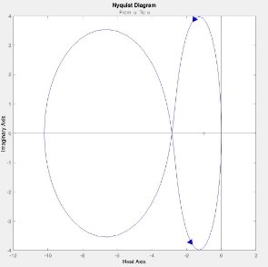

# An-Inverted-Pendulum-Stabilizer-Using-PID-Controller-and-Lead-Lag-Compensator
The inverted pendulum has a unique trait; it is unpredictable, non-linear, and consists of multiple variables. Balancing by PID controller is a continuous process where it corrects the feedback system error from the difference between the measured value and the desired value. Balancing by Lead-Lag compensator is designing a lead compensator for the process to change the shape of the root locus and choose the gain so that the poles are in the desired position and designing a lag compensator to leave the dominant closed-loop poles of the lead-compensated process in approximately the position but provide extra low-frequency gain.

**The Inverted Pendulum System**

Shiva Shakeri

Aliasghar Bagheri Department of ECE, University of Tehran Linear Control Systems

Dr. Aras Adhami

July 2021

1. **Introduction**

Balance an inverted pendulum on a moving cart that moves horizontally in one direction, is a classic problem in control systems.

In this project, different methods are presented to keep the inverted pendulum in equilibrium. In this system, an inverted pendulum is connected to a chariot that moves in the direction of the horizontal axis when a force is applied. This system has two intrinsic equilibrium points that One is stable and the other is unstable. The stable equilibrium point is where the pendulum is down, which naturally goes into this state without the need for any controllers. The unstable equilibrium point is related to the position where the pendulum is placed vertically on the cart, which requires a controller to balance. The main goal of this project is to design a controller to keep the pendulum at its unstable equilibrium point.

First, we model the transfer function of the system using mechanical equations and then we simulate the system with MATLAB to clarify the general situation of the problem. First, we design a PID controller for this system and the results. Then we design the lag-lead controller system using the locus root diagram and observe the results in the simulation, and finally, we design the controller using the bad diagram and the Nyquist diagram. And we simulate the results of this step.

From this simulation, we can observe the intrinsic response of the system and obtain the desired results by placing a controller and changing its coefficients.

2. **Inverted Pendulum Modeling**

The inverted pendulum system is shown in Figure 2.1, which consists of a cart, a pendulum, and a rail track to restrict the cart's movement in one direction as well as to determine its position. The reverse pendulum system of Figure 2.1 is actuated by a force. Next, we obtain the dynamic equations of this system and linearize them around the equilibrium point. (It is assumed that the pendulum deviates only about a few degrees from the equilibrium point).

Figure 2.1: Diagram of Inverted Pendulum-Cart system

1. **Force analysis and system equations**

According to Figure 2.2, an inverted pendulum with mass m and length l meters is placed on a chariot with mass M. The chariot moves in the horizontal direction. The force causes to move and consequently causes the reverse pendulum to balance.

The parameters of the studied system are given in Table 2.1.

Table 2.1: Inverted pendulum system parameters

Mass of the Cart 0. 5 

Mass of the Pendulum 0. 2 Coefficient of Friction for Cart 0. 1  / / Length to Pendulum Center of 0. 3 

Mass

Mass Moment of Inertia of the 6 × 10−3 . 2 Pendulum

Force applied to the Cart

Cart Position Coordinate

θ Pendulum Angle from vertical

Figure 2.2: Free-body Diagram of Inverted Pendulum-Cart system

Summing the forces in the free-body diagram of the cart in the horizontal direction:

ẍ + ẋ  +   =  (2.1)

Summing the forces in the free-body diagram of the pendulum in the horizontal direction, you get the following expression for the reaction force :

- ẍ  +  θ¨  θ  −  ፅ2 θ (2.2)

If you substitute equation (2.2) into the equation (2.1) , you get one of the two governing equations for this system.

(  +  )ẍ  +  ẋ  + θ¨  θ − ፅ2 θ  =  (2.3)

To get the second equation of motion for this system, sum the forces perpendicular to the pendulum. Solving the system along this axis greatly simplifies the mathematics.

θ  + θ  −  θ  =  θ¨  +  ẍ  θ  (2.4)

To get rid of the and terms in the equation above, sum the moments about the centroid of the pendulum to get the following equation.

- θ  −  θ  =  − ẍ θ (2.5)

now, this set of equations needs to be linearized. Specifically, we will linearize the equations about the vertically upward equilibrium position,θ = π, and will assume that the system stays within a small neighborhood of this equilibrium. Let ϕ represent the deviation of the pendulum’s position from equilibrium, that is, θ = ϕ + π. Again presuming a small deviation (ϕ) from equilibrium, we can use the following small angle approximations of the nonlinear functions in our system equations(To linearize sinusoidal functions, the angle must be less than 30 degrees, about 0.5 radians):

θ  =  (π + ϕ) ≃  − 1 (2.6)

θ  =  (π + ϕ) ≃  − ϕ (2.7) ፅ2 ≃ 0 (2.8)

After substituting the above approximations into our nonlinear governing equations, we arrive at the two linearized equations of motion.

⇒( + 2)θ¨  − θ  =  ẍ (2.9) ⇒( + )ẍ  +  ẋ  −  θ¨  =  ( ) (2.10)

2. **Transfer function**

To obtain the transfer functions of the linearized system equations, we must first take the Laplace transform of the system equations assuming zero initial conditions.(we write the equations approximately sinθ ⋍ θ).

2 2 Θ( )  =  . ( ). 2 (2.11) ( + ). Θ( ). −

( + ). ( ). 2 + ( )  −  Θ( ) 2  =  ( ) (2.12) Solve equation (2.11) for ( ):

2

( )  = [ +  − ]. Θ( ) (2.13)

2

Then substitute equation (2.13) into equation (2.12):

2 2

( + )[ +  − ]. Θ( ). 2  +  [ +  − ]. Θ( ).  −  . Θ( ). 2  =  ( )

2 2

(2.14)

The transfer function is then the following:

2

Θ( ) = 

( ) 4+ ( +  2) 3− ( + ) 2− (2.15)

- [( + )( + 2) −  2 2]

(2.16)

Now we assign the values of the parameters in the transfer function (eq. 2.15):

Θ( ) 4.54 

Gpend= ( ) = 3−0.18  2−31.18 −4.45 (2.17)

The function of converting the cart position to the force input will also be as follows:

( ) ( + 2) 2− 

Gcart= = (2.18)

( ) 4+ ( +  2) 3− ( + ) 2−

3. **Equations of state**

The state-space equations of this system can be obtained as follows

- [ ( ), ẋ, θ, ፅ] (2.19)

ẋ  =   +  (2.20)

- +  (2.21)

Equations (2.20) and (2.21) give Equation (2.22):

( )  =  ( ) (2.22) Equations (2.9) and (2.10) give Equation (2.23):

2

ẍ  =  ( +  )θ¨ − θ

(2.23)

Equations (2.10) and (2.23) give Equation (2.24):

( + )[ ( + 2)θ¨ − θ] + ẋ −  =  θ¨ (2.24) ẋ − − ( + ) θ = θ¨(  −  + (  +  2)) (2.25)

θ¨  =   −  ẋ  − ( + )ẍ (2.26)

θ¨  =  −  ẋ − ( + )ẍ (2.27)

θ + (  +  2 ( + )ẍ ) (2.28) ẍ  =  − )( −  ẋ  −

ẍ  =  − θ +  ( + 2) −  ( + 2)ẋ (2.29)

+ ( + )( + 2)

Since the equations are linear, they can then be put into the standard matrix form shown

below:

 (2.30)

 (2.31)

Now we want to plot the impulse response using the obtained transfer function using “Impulse()” in MATLAB. Code is in the matlab “ImpulseResponse1” file and as can be seen in Figure 2.3, the unstable step response of the system tends to be infinite.

Figure 2.3: Impulse Response of G\_pend

3. **Controller Design using Bode Plot and Nyquist Diagram**

First, we model the transfer function of the system using mechanical equations and then we simulate the system with MATLAB to clarify the general situation of the problem. First, we design a PID controller for this system and the results. Then we design the lag-lead controller system using the locus root diagram and observe the results in the simulation, and finally, we design the controller using the bad diagram and the Nyquist diagram. And we simulate the results of this step.

1. **Transfer functions**

First, we define the constants of Table 2.1 in MATLAB.then by assigning the values in the transfer functions (Eq. 2.15 and Eq. 2.18).

s = tf('s'); M = 0.5;

m = 0.2;

b = 0.1; J = 0.006;

g = 9.8;

l = 0.3;

q = (M + m) \* (J + m \* l^2)-(m \* l)^2;

G\_pend = (m\*l\*s/q)/(s^3 + (b\*(J + m\*l^2))\*s^2/q - ((M + m)\*m\*g\*l)\*s/q - b\*m\*g\*l/q);

G\_cart = (((J+m\*l^2)/q)\*s^2 - (m\*g\*l/q))/(s^4 + (b\*(J + m\*l^2))\*s^3/q - ((M

+ m)\*m\*g\*l)\*s^2/q - b\*m\*g\*l\*s/q);

sys\_tf = [G\_cart ; G\_pend];

Output is shown below:

Which corresponds to equations 2.15 and 2.18 that we obtained.

2. **Root Locus**

As we saw in the previous sections, the pendulum angle transfer function(Gpend) was obtained as equation 2.17.

This function has a zero at 0 and three poles at -0.14, 5.57, -5.54

σ  =  −0.14 + 5.57 −5.54 =  − 0. 055 (3.1)

2

θ  =  (2 +1)π (3.2)

−

θ = π , 3π (3.3)

2  2

To calculate critical points we assume= 0:

4. 54( 3 + 0. 18 2 − 31. 18 − 4. 45) − 4. 45 (3 2 + 0. 36 − 31. 18) = 0

(3.4)

3  2
- 8. 9 + (0. 8172 − 1. 6) + (− 141. 55 + 138. 751) − 19. 8 = 0 (3.5)
- 8. 9 3 + 0. 787 2 − 2. 8 − 19. 8  = 0 (3.6) Now we plot the root locus using “rlocus()” in Matlab:

s = tf('s');

M = 0.5;

m = 0.2;

b = 0.1;

J = 0.006;

g = 9.8;

l = 0.3;

q = (M + m) \* (J + m \* l^2)-(m \* l)^2;

G\_pend = (m\*l\*s/q)/(s^3 + (b\*(J + m\*l^2))\*s^2/q - ((M + m)\*m\*g\*l)\*s/q - b\*m\*g\*l/q); rlocus(G\_pend);

3. **System stabilization**

As Figure 3.1 shows one of the roots of the pendulum is on the right side of the plane(This function has a zero at 0 and three poles at -0.14, 5.57, -5.54). The system is unstable because this right pole is always present. Therefore, a part of our root locus is between zero and this pole and causes the instability of the system.

In general, zero must be injected into the system to bring the branches of the root locus shown in Figure 3.1. To stabilize the equation transfer function, we use the MATLAB GUI, Control System Designer section and use code “controlSystemDesigner(‘bode’, G\_pend)” (code is in the “BodePlot” file).

When we Right-click on the bode chart in the Add Pole / Zero section we should select Integrator.To draw a Nyquist diagram in the toolbox, we select the Plot New section of the New Nyquist section.As shown in the Nyquist diagram in Figure 3.3, we go around -1 in a clockwise direction once( = 1).Since the open loop transfer function has a pole on the right side of the complex plane, then from the following equation:

- +   = 2 (3.7)

So we have two unstable poles in the closed-loop.To solve this problem, we inject two zeros in -1.

Figure 3.4 shows that the closed-loop transfer function is still unstable, but if the compensator function is multiplied by a gain and the point -1 be in the side where the graph moves counter clockwise, then will be 0 and the final transfer function becomes stable(Figure 3.5).

Figure 3.5: Nyquist Diagram after two zero added

By adding the system gain we can shift the diagram to the left. Then will be -1.(Figure

3.5 and 3.6)

Figure 3.5: Compensator Editor Window

Figure 3.6: Stabilized Nyquist Diagram

In this case, the system is stable. To improve the response, we change the zeros and poles to get closer to the design goals.(Figure 3.7 and 3.8)

Figure 3.7: Final Compensator

Figure3.8: Final Stabilized Nyquist Diagram

Finally :

( ) = 10 (0.91 + 1)(0.2 + 1) (3.8)

( )  =  ( ). ( ) (3.9) ( )  ≃ 8.273 3 + 50.45 2 + 45.45 (3.10)

4 3 2

+ 18.18 − 31.18 + 4.455

Final stabilized transfer function will be:

( )  =  ( ) (3.11)

1 +  ( )

**4. PID Controller Design**

At this stage, we want to design the PID controller in such a way that when the impulse force of 1 Newton enters the system, the system settling time is less than 5 seconds and the deviation from the vertical position of the pendulum is less than 0.05 radians.

1. **General Schematic of the Controller**

Since we are attempting to control the pendulum's position, which should return to the vertical after the initial disturbance, the reference signal we are tracking should be zero. This type of situation is often referred to as a Regulator problem. The external force applied to the cart can be considered as an impulsive disturbance.So the schematic of the PID is depicted in Figure 4.1.

Figure 4.1: PID Controller Schematic Diagram

For convenience, we simplify the transfer function into a familiar single-input form. This simplified form is shown in Figure 4.2.

Figure 4.2: Simplified Form of PID Controller

Φ( ) ( )

( )  =  =

( ) 1 +  ( ) ( )

(4.1)

2. **Manual Controller Design**

Using the equations 2.1-2.6, clearly equation 2.36 has 3 roots. So we can draw the Nyquist diagram which os shown in Figure 4.3.

Figure 4.3: Nyquist Diagram of Eq(2.37)

As we can see from the figure above, one of the roots of the pendulum is located on the right side of the plane, so the system is unstable because this right pole is always present. It is necessary to add a polarity in the center to simplify with zero origin, so we will have:

( )  =  4.54 (4.2)

3 + 0.18 2 − 31.18 − 4.45

σ  =  − 0. 045 (4.3)

θ = (2 +1)π (4.4)

3

θ = π , 5π , π  (4.5)

3 3

2 (4.6)

- (− 3 − 0. 36  + 31. 18)4. 54  = 0
- 3. 16  > 0;  =− 3. 26  < 0 (4.7)

Figure 4.4: Nyquist Diagram of Eq(4.2)

Now we can say the controller function is (100 +  +  1 ).

- ( )  =  4.54 (4.8) 1 ( 3 + 0.18 2 −31.18 − 4.45) + 4.45( 2 + 100 + 1)

∆( )  =  ( 2  + 4. 72  + 422. 8) (4.9)

- ω  = 20. 5 , ζ  = 0. 11(ζis overshoot) (4.10)
- π = 0. 15, 2  = 0. 3,  3  = 0. 45  (4.11)
  - ( −πζ ) (4.12)

(1−ζ2)

- 0. 18 that is not less than 0.05.

so: ( )  =  4.54 (4.13)

2 ( 3 + 0.18 2 −31.18 − 4.45) + 4.45 ( + )( + )

1 2

< 5  ⇒ 4 < 5 (4.14) 3ω

3  +  2(0. 18  + 4. 54 )  +  (( + ) ( 4. 54)  − 31. 18)  − 4. 45  + 4. 54  = 0

1 2 1 2

(4.15)

∆( )  =  2  + (4. 54  + 0. 18)  + ( ( + )(4. 45)  − 31. 18) (4.16)

1 2

- ( −πζ )  < 0. 05  ⇒ ζ = 0. 68 (4.17)

2

(1−ζ )

23ω  = 4. 54 + 0. 18, ω 2 = ( + )(4. 45) − 31. 18 (4.18)

1 2

Since we have ζ = 0. 68, let = 0. 01:

1

- 0. 98/0. 01, 1. 36ω  = 4. 54  + 0. 18, ω 2 = 4. 45  − 31. 18 (4.19)

2 2

- = 19. 6   5  ω  20. 34 (4.20)

2 

so the controller is : C(s)=s ( +5)( +0.01)

To draw the impulse response:

4.54 = (413.74)(0.01) = 0.01 (413.74) (4.21)

2 + 89.1 + 413.74 2 + 89.1 + 413.74 ( + 84.18)( + 4.9)

- : 0. 05( −84.18  +  −4.9 ) that is shown in Figure (4.5).

Figure 4.5: Impulse Response

3. **Controller Design Using MATLAB**

This closed-loop transfer function can be modeled in MATLAB by running the following code. Specifically, we define our controller using the pid object within MATLAB. We then use the feedback command to generate the closed-loop transfer function ( ) as depicted in the figure above where the disturbance force is the input and the deviation of the pendulum angle from the vertical ϕ is the output.

s = tf('s');

M = 0.5;

m = 0.2;

b = 0.1;

J = 0.006;

g = 9.8;

l = 0.3;

q = (M + m) \* (J + m \* l^2)-(m \* l)^2;

num1 = [m\*l/q  0 ];

den1 = [1  b\*(J+m\*l^2)/q  -(M+m)\*m\*g\*l/q  -b\*m\*g\*l/q ]; G\_pend=tf(num1,den1);

Kp = 1;

Ki = 1;

Kd = 1;

C = pid(Kp, Ki, Kd);

T = feedback(G\_pend, C);

Now we  begin to tune our controller. First we examine the response of the closed-loop system to an impulse disturbance for this initial set of control gains.By running the code “t=0:0.01:10; impulse(T,t)” Figure 4.6 is shown.

Figure 4.6: Response of Pendulum Position to an Impulse Disturbance under PID control (Kp = Ki = Kd = 1)

This response is still not stable. We begin to modify the response by increasing the proportional gain. Increase the variable to see what effect it has on the response. So we

modify our code to the following where = 100 and run in the command window, we get the response plot shown in Figure 4.7.

Figure 4.7: Response of Pendulum Position to an Impulse Disturbance under PID control (Kp =100, Ki = Kd = 1)

Specifically, the settling time of the response is determined to be 1.64 seconds, which is less than the requirement of 5 seconds. Since the steady-state error approaches zero in a sufficiently fast manner, no additional integral action is needed. We can set the integral gain constant to zero to see that some integral control is needed. The peak response, however, is

larger than the requirement of 0.05 radians. Recall that overshoot often can be reduced by increasing the amount of derivative control. After some trial and error it is found that a derivative gain of = 20 provides a satisfactory response. Modifying our codes as follows and

re-running produce the response plot shown in Figure 4.8.

As we can see, the overshoot has been reduced so that the pendulum does not move more than 0.05 radians away from the vertical. Since all of the given design requirements have been met, no further iteration is needed.

Figure 4.8: Response of Pendulum Position to an Impulse Disturbance under PID control (Kp =100, Ki =1, Kd = 20)

4. **Cart Position**

In Figure 4.1,  a block diagram for the inverted pendulum system was given. The diagram was not entirely complete. The block representing the response of the cart's position was not included because that variable is not being controlled. It is interesting though, to see what is happening to the cart's position when the controller for the pendulum's angle ϕ is in place. To see this we need to consider the full system block diagram as shown in Figure 4.9 and it is simplified in Figure 4.10.

Figure 4.9: Completed System Block Diagram

Figure 4.10: Simplified Completed System Block Diagram

The block ( ) is the controller designed for maintaining the pendulum vertical. The closed-loop transfer function ( ) from an input force applied to the cart to an output of cart

2

position is, therefore, given by the following.

( )  =  ( ) = ( ) (4.22) 2 ( ) 1 +  ( ) ( )

Using equation (2.18) and (4.22), we run the code below:

s = tf('s');

M = 0.5;

m = 0.2;

b = 0.1;

J = 0.006;

g = 9.8;

l = 0.3;

q = (M + m) \* (J + m \* l^2)-(m \* l)^2;

Kp = 100;

Ki = 1;

Kd = 20;

C = pid(Kp,Ki,Kd);

num1 = [m\*l/q  0 ];

den1 = [1  b\*(J+m\*l^2)/q  -(M+m)\*m\*g\*l/q  -b\*m\*g\*l/q ];

G\_pend=tf(num1,den1);

G\_cart = (((J+m\*l^2)/q)\*s^2 - (m\*g\*l/q))/(s^4 + (b\*(J + m\*l^2))\*s^3/q - ((M + m)\*m\*g\*l)\*s^2/q - b\*m\*g\*l\*s/q); T2 = feedback(1,G\_pend\*C)\*G\_cart;

t = 0:0.01:5;

impulse(T2, t);

As we can see in Figure 4.11, the cart moves in the negative direction with approximately constant velocity. Therefore, although the PID controller stabilizes the angle of the pendulum, this design would not be feasible to implement on an actual physical system.

Figure 4.11: Response of Cart Position to an Impulse Disturbance Under PID Control
